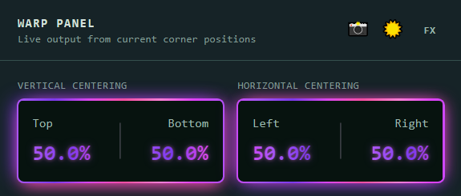

# Card Centering

Browser-based trading-card centering measurement with automatic card detection, perspective correction, and adjustable border guides.

**Live app:** [cardcentering.app](https://cardcentering.app)



> **Privacy note:** Processing happens in the browser, but uploaded images may also be retained server-side to improve card detection. See [Privacy, processing, and image storage](#privacy-processing-and-image-storage).

Upload a trading-card photo to automatically detect the card, correct perspective, estimate the printed borders, and measure top/bottom and left/right centering. Refine the original photo's corners in the **SOURCE PANEL**, then inspect the corrected card and adjust its inner-border guides in the **WARP PANEL**.

The interface includes a Retro Lab theme, alternative color themes, responsive controls, and a guided tutorial.

## Features

- Automatic outer-card detection using an ONNX model in the browser.
- Perspective correction with adjustable source corners and inner-border guides.
- Vertical (top/bottom) and horizontal (left/right) centering percentages, displayed to one decimal place.
- Learned candidate ranking helps select automatic inner borders, with the original heuristic retained as a safety fallback.
- Optional **Curved Edge Assist** for fitting mildly bowed card edges.
- Corner and edge minimaps, directional nudges, adjustable step size, and desktop keyboard controls.
- Zoom around selected source controls for precise alignment, plus touch zoom on mobile.
- Screenshot export of measurements.
- A persistent browser cache for the five most recently used unique uploads.

## Using the app

1. Upload or drop a clear card photo, or choose **Try Me** for a sample.
2. Wait for the image and initial processing to load. Adjustment controls enable when ready.
3. Check all four corners in the **SOURCE PANEL**. Select a corner and use the directional pad to refine its position.
4. Check the inner borders in the **WARP PANEL**. Select and adjust each guide to match the printed border.
5. Read the top/bottom and left/right percentages, then use the camera control to save a screenshot.

On desktop, WASD or arrow keys nudge the selected control. On mobile, use the directional pads and pinch outward to zoom in. Step Size controls nudge distance. The tutorial provides guidance for the current platform.

## Accuracy and limitations

The tool measures centering and border balance. It does not assess surface condition, whitening, edge wear, scratches, print defects, authenticity, or a final grading outcome.

Visually check automatic guides before relying on the measurements. Perspective correction and careful manual guide adjustment can improve accuracy; unusual layouts or weak, ambiguous printed borders may require manual adjustment.

## Privacy, processing, and image storage

Card inference and measurement run in the browser. **Uploads are not necessarily local-only:** the app also makes a best-effort `/api/log-upload` request to retain images for improving detection. Capture failure does not block card processing.

- Development capture writes to `api/card-api/upload_logs/`, or the directory specified by `UPLOAD_LOG_DIR`.
- Production capture uses private Vercel Blob storage and requires server-side storage configuration. It does not fall back to production disk.
- Independently, IndexedDB stores up to five unique original images in the user's browser, evicting the least recently used entry.
- Exact duplicates are identified by SHA-256 of file bytes, not filenames. A cache hit avoids another capture request.
- Cached original images survive model updates. Derived analysis is reused only when its processing version matches; otherwise processing runs again from the cached image.
- Clearing browser site data removes the local cache. Storage or hashing failures fall back to the uncached workflow.

See [upload logging](UPLOAD_LOGGING.md) and [recent-upload cache](src/card-ui/RECENT_UPLOAD_CACHE.md) for implementation details. Keep storage credentials on the server.

## Run locally

Use Node.js **22.18+** and npm. A current browser with WebAssembly, Canvas, Web Crypto, and IndexedDB support is recommended.

```sh
git clone https://github.com/mf11y/card-centering-app.git
cd card-centering-app/src/card-ui
npm ci
npm run dev -- --host 127.0.0.1
```

Open the local URL printed by Vite (normally `http://127.0.0.1:5173`). On Windows PowerShell, use `npm.cmd` if script execution policy blocks `npm`.

Both model assets are included under `src/card-ui/static/models/`. The normal browser workflow does not require the Python API or a separate inference server.

## Development and deployment

The frontend uses **Svelte 5, SvelteKit, TypeScript, Tailwind CSS, Vite, and ONNX Runtime Web**. Server-side upload capture uses Sharp and the Vercel Blob SDK.

From `src/card-ui`:

```sh
npm run build
npm run preview
```

The app is configured with the Vercel adapter; set the deployment root to `src/card-ui`. Local Windows builds may encounter an `EPERM` symlink error during Vercel packaging even after client/server compilation succeeds.

Model fingerprints are generated automatically at dev/build startup. Restart the dev server after replacing model assets. For output-affecting algorithm changes, update `CARD_PIPELINE_COMPAT_VERSION` in `processing-version.ts`; cosmetic changes do not require a version bump.

Useful checks:

```sh
node --test scripts/model-fingerprints.test.mjs
node --test scripts/tutorial.test.ts scripts/learned-inner-ranker.test.ts scripts/top-inner-rescue.test.ts
```

These are targeted checks, not a complete end-to-end test suite. Browser cache verification and its prerequisites are documented in [RECENT_UPLOAD_CACHE.md](src/card-ui/RECENT_UPLOAD_CACHE.md).

## Repository map

| Path | Purpose |
| --- | --- |
| `src/card-ui/src/routes/+page.svelte` | Main workspace and interactions |
| `src/card-ui/src/routes/layout.css` | Shared styling and themes |
| `src/card-ui/src/lib/card-centering/` | Geometry, detection, ranking, and controls |
| `src/card-ui/src/lib/tutorial/` | Platform-aware tutorial |
| `src/card-ui/src/lib/recent-upload-cache.ts` | IndexedDB upload cache |
| `src/card-ui/src/routes/api/log-upload/` | Best-effort capture endpoint |
| `src/card-ui/static/models/` | Browser model assets |
| `src/card-ui/scripts/` | Focused tests and diagnostic utilities |
| `api/card-api/` | Python API tooling, separate from the normal browser workflow |

## Technical docs

- [Learned inner-border ranker](src/card-ui/LEARNED_INNER_RANKER.md): architecture, model details, and rollback instructions. Historical rollout notes describe the original integration session.
- [Recent-upload cache](src/card-ui/RECENT_UPLOAD_CACHE.md): browser image storage and processing-version compatibility.
- [Upload logging](UPLOAD_LOGGING.md): upload capture and server-side storage behavior.
